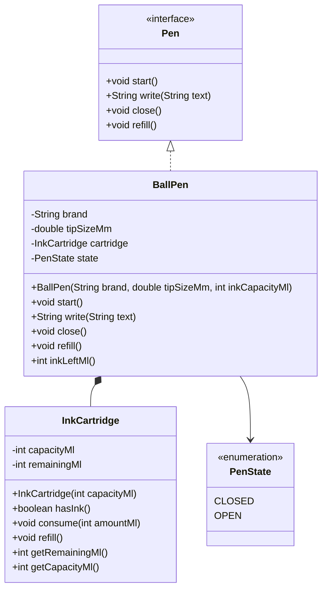

# Design a Pen

This module contains:
- A simple class design for a `Pen`
- A Java implementation with the required behaviors: `start`, `write`, `close`, and `refill`

## Class Diagram

## Notes

- `start()` opens the pen for writing.
- `write(text)` writes only when the pen is started and ink is available.
- `close()` closes the pen.
- `refill()` restores ink to full cartridge capacity.
