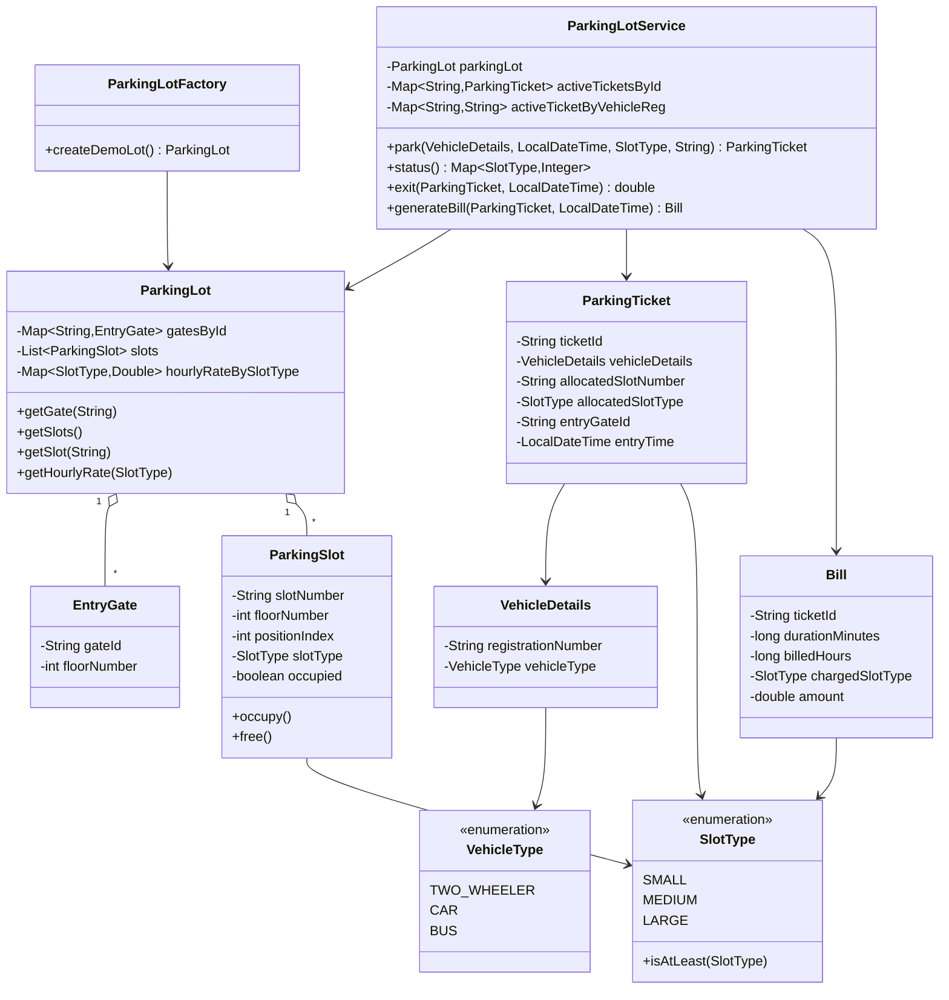

# Multilevel Parking Lot

## Problem Coverage

This solution supports:
- Slot types: `SMALL` (2-wheelers), `MEDIUM` (cars), `LARGE` (buses)
- Different hourly rates per slot type
- Multiple entry gates
- Nearest available compatible slot assignment by entry gate
- Vehicle-to-slot compatibility rules:
  - 2-wheeler -> small/medium/large
  - car -> medium/large
  - bus -> large only
- Billing based on **allocated slot type**
- APIs: `park(...)`, `status()`, `exit(...)`

## Class Diagram



## Design and Approach

- `ParkingLot` is the static configuration: gates, slots, and hourly rates.
- `ParkingLotService` contains all business logic and the required APIs.
- Slot allocation strategy:
  - Filter to available and compatible slots.
  - Respect `requestedSlotType` as the minimum slot class.
  - Choose nearest slot to the `entryGateID` using distance:
    - floor difference (high weight) + position difference.
- Ticket stores all required details:
  - vehicle details
  - slot number
  - slot type
  - entry time
- Exit flow:
  - Validate ticket and exit time.
  - Calculate duration from entry to exit.
  - Bill with ceiling-hour rule (minimum 1 hour).
  - Rate is derived from allocated slot type.
  - Free the slot and close active ticket.

## API Signatures

```java
ParkingTicket park(VehicleDetails vehicleDetails,
                   LocalDateTime entryTime,
                   SlotType requestedSlotType,
                   String entryGateID)

Map<SlotType, Integer> status()

double exit(ParkingTicket parkingTicket, LocalDateTime exitTime)
```

## Compile and Run

```powershell
Set-Location "d:\Asmit\LLD101\multilevel-parking-lot"
if (Test-Path out) { Remove-Item -Recurse -Force out }
New-Item -ItemType Directory -Path out | Out-Null
javac -d out src\com\example\*.java
java -cp out com.example.Main
```
